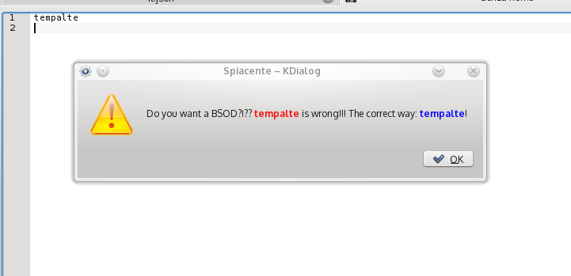

#SyntaxAlert

Scan **all** your digited letter for wrong words and alert you!  
Is a nice keylogger that not save data!  

* File for (completed) words wrong
* File dictionary for the error report (by kdialog)
* File for warning the user about a word that usually writes bad (by notify-send)



#Require

* xinput
* kdialog
* notify-send
* play (inline code for execute KDE sound)

#How to use

Check with `xinput list` your keyboard number for use it  

Only En words:  

```syntaxalert.py -words ./words/en.json -alerts ./alerts/en.txt -xinput 10``` 

En and It words:  

```syntaxalert.py -words ./words/en.json -alerts ./alerts/en.txt -words2 ./words/it.json -alerts2 ./alerts/it.txt -warning ./warnings/it.txt -xinput 10```